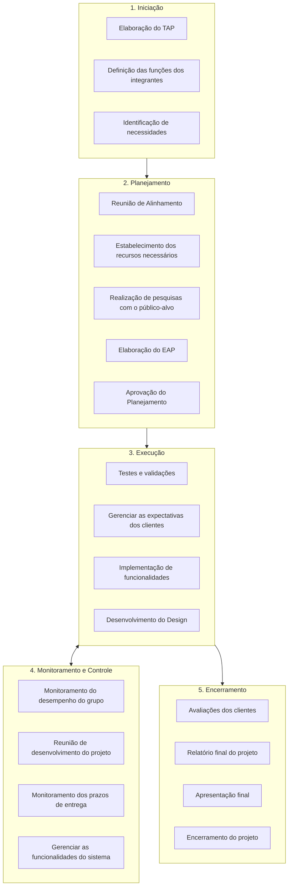
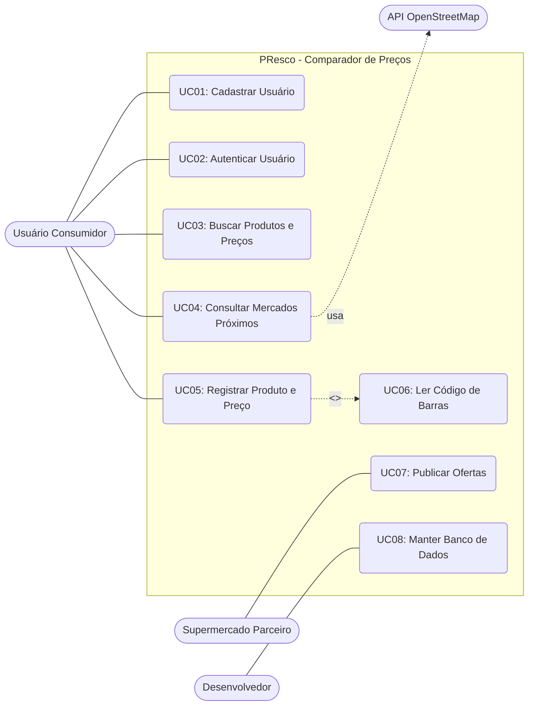

# Documentação do Projeto PResco

Este documento contém a conversão do fluxo de gerenciamento do projeto **PResco** a partir do arquivo fornecido, além dos diagramas explicativos no formato **Mermaid**.

---

## 1. Ciclo de Vida do Projeto (Fases e Atividades)

O projeto está estruturado em **5 etapas principais** de gerenciamento:

### 1. Iniciação
* **Elaboração do TAP** (Termo de Abertura do Projeto)
* **Definição das funções** dos integrantes
* **Identificação de necessidades**

### 2. Planejamento
* **Reunião de Alinhamento**
* **Estabelecimento dos recursos** necessários
* **Realização de pesquisas** com o público-alvo
* **Elaboração da EAP** (Estrutura Analítica do Projeto)
* **Aprovação do Planejamento**

### 3. Execução
* **Testes e validações**
* **Gerenciar as expectativas** dos clientes
* **Implementação de funcionalidades**
* **Desenvolvimento do Design**

### 4. Monitoramento e Controle
* **Monitoramento do desempenho** do grupo
* **Reunião de desenvolvimento** do projeto
* **Monitoramento dos prazos** de entrega
* **Gerenciar as funcionalidades** do sistema

### 5. Encerramento
* **Avaliações dos clientes**
* **Relatório final** do projeto
* **Apresentação final**
* **Encerramento do projeto**

---

## 2. Diagrama de Fluxo das Fases do Projeto (Mermaid)

---

## 3. Diagrama de Casos de Uso (Mermaid)

