# Estrutura do Projeto: Presco

Abaixo está a estrutura do projeto **Presco**, dividida em suas respectivas fases, seguida por um diagrama visual.

## 1. Estrutura em Tópicos

*   **Iniciação**
    *   Elaboração do TAP
    *   Definição das funções dos integrantes
    *   Identificação de necessidades
    *   Reunião de Alinhamento
*   **Planejamento**
    *   Estabelecimento dos recursos necessários
    *   Realização de pesquisas com o público-alvo
    *   Elaboração do EAP
    *   Aprovação do Planejamento
*   **Execução**
    *   Testes e validações
    *   Gerenciar as expectativas dos clientes
    *   Implementação de funcionalidades
    *   Desenvolvimento do Design
*   **Monitoramento e Controle**
    *   Monitoramento do desempenho do grupo
    *   Reunião de desenvolvimento do projeto
    *   Monitoramento dos prazos de entrega
    *   Gerenciar as funcionalidades do sistema
*   **Encerramento**
    *   Avaliações dos clientes
    *   Relatório final do projeto
    *   Apresentação final
    *   Encerramento do projeto

---

## 2. Diagrama Visual (Mermaid)

```mermaid
graph TD
    %% Nó Principal
    A[Presco]

    %% Fases do Projeto
    A --> B[Iniciação]
    A --> C[Planejamento]
    A --> D[Execução]
    A --> E[Monitoramento e Controle]
    A --> F[Encerramento]

    %% Atividades - Iniciação
    B --> B1[Elaboração do TAP]
    B --> B2[Definição das funções dos integrantes]
    B --> B3[Identificação de necessidades]
    B --> B4[Reunião de Alinhamento]

    %% Atividades - Planejamento
    C --> C1[Estabelecimento dos recursos necessários]
    C --> C2[Realização de pesquisas com o público-alvo]
    C --> C3[Elaboração do EAP]
    C --> C4[Aprovação do Planejamento]

    %% Atividades - Execução
    D --> D1[Testes e validações]
    D --> D2[Gerenciar as expectativas dos clientes]
    D --> D3[Implementação de funcionalidades]
    D --> D4[Desenvolvimento do Design]

    %% Atividades - Monitoramento e Controle
    E --> E1[Monitoramento do desempenho do grupo]
    E --> E2[Reunião de desenvolvimento do projeto]
    E --> E3[Monitoramento dos prazos de entrega]
    E --> E4[Gerenciar as funcionalidades do sistema]

    %% Atividades - Encerramento
    F --> F1[Avaliações dos clientes]
    F --> F2[Relatório final do projeto]
    F --> F3[Apresentação final]
    F --> F4[Encerramento do projeto]

    %% Estilização Básica
    style A fill:#2e3a46,stroke:#333,stroke-width:2px,color:#fff
    style B fill:#4a90e2,stroke:#333,stroke-width:1px,color:#fff
    style C fill:#4a90e2,stroke:#333,stroke-width:1px,color:#fff
    style D fill:#4a90e2,stroke:#333,stroke-width:1px,color:#fff
    style E fill:#4a90e2,stroke:#333,stroke-width:1px,color:#fff
    style F fill:#4a90e2,stroke:#333,stroke-width:1px,color:#fff
```

