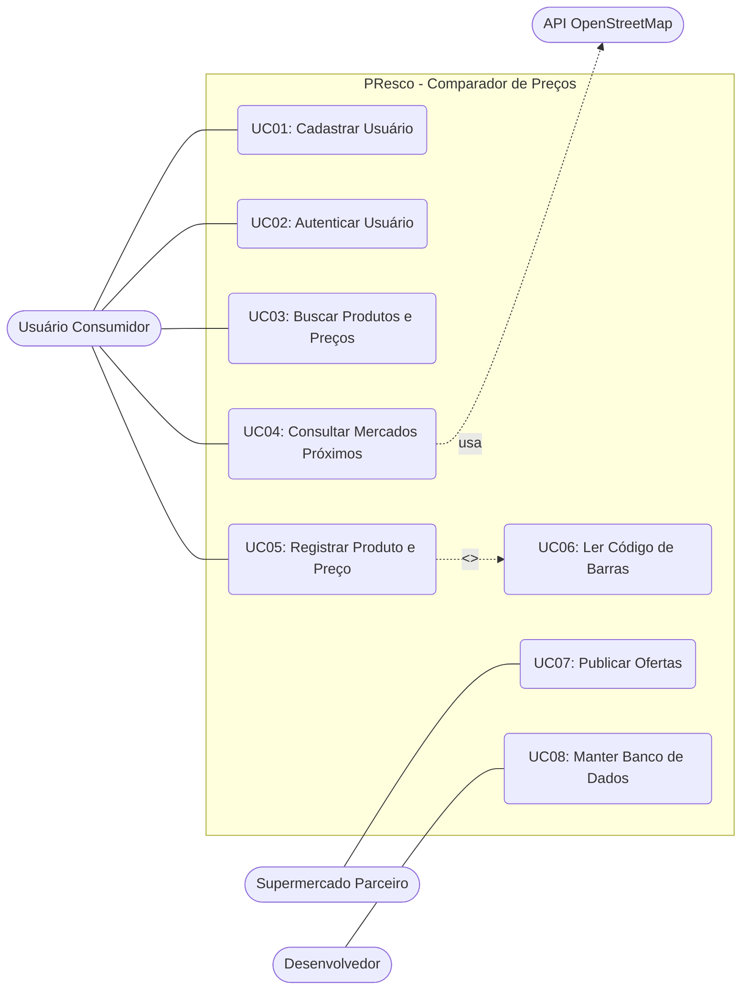

# Diagrama de Casos de Uso - PResco (Grupo 03)

**Referência:** Engenharia de Software Moderna (engsoftmoderna.info)

## 1. Diagrama de Casos de Uso

---

## 2. Descrição dos Casos de Uso (TODOS extraídos)

### UC01: Cadastrar Usuário
* **Ator:** Usuário
* **Descrição:** Permite que o novo usuário crie uma conta no sistema para garantir a integridade dos dados registrados.

### UC02: Autenticar Usuário (Login)
* **Ator:** Usuário, Supermercado Parceiro, Desenvolvedor
* **Descrição:** Submete o usuário a métodos rigorosos de autenticação para liberar o uso das funcionalidades da plataforma.

### UC03: Buscar Produtos e Melhores Preços
* **Ator:** Usuário
* **Descrição:** Permite que o usuário pesquise por um produto e visualize os melhores valores registrados colaborativamente nos mercados da região.

### UC04: Consultar Mercados Próximos
* **Ator:** Usuário, API OpenStreetMap
* **Descrição:** Acessa a funcionalidade de mapa/lista do aplicativo, utilizando o GPS do smartphone para cruzar dados com a API do OpenStreetMap, filtrando e exibindo mercados parceiros ou cadastrados nas redondezas.

### UC05: Registrar Produto e Preço
* **Ator:** Usuário
* **Descrição:** Permite ao consumidor publicar itens e valores que encontra dentro dos estabelecimentos em tempo real.
* **Inclusões:** Inclui obrigatoriamente o caso de uso UC06 (Ler Código de Barras), exigindo o uso da câmera do smartphone, bem como a localização (GPS) para vincular o preço ao mercado.

### UC06: Ler Código de Barras
* **Ator:** Usuário
* **Descrição:** Caso de uso incluído (`<<include>>`) no UC05, responsável por ativar a câmera do smartphone e decodificar a identidade do produto.

### UC07: Publicar Publicidade/Ofertas
* **Ator:** Supermercado Parceiro
* **Descrição:** Mercados parceiros utilizam o aplicativo como um canal direto de publicidade para promover seus produtos aos usuários.

### UC08: Manter Banco de Dados
* **Ator:** Desenvolvedor
* **Descrição:** Acesso direto e integral ao banco de dados relacional online para manutenções, gerenciamento de dados de colaboração comunitária e garantia de integridade da infraestrutura.
